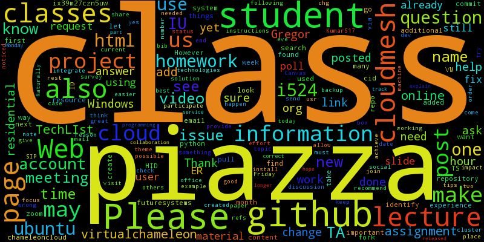
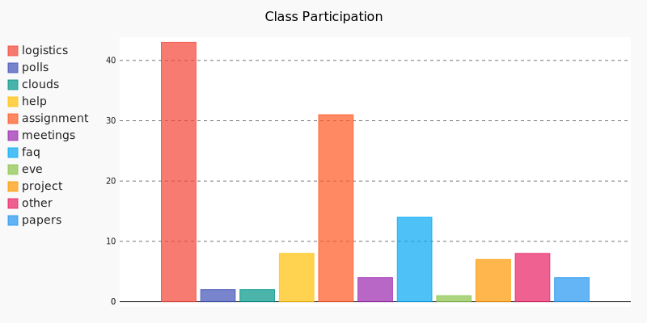

Piazza Data Mining
==================

* Tim Whitson @whitstd
* Gregor von Laszewski (laszewski@gmail.com) 

Contributors:

* Gary Bean: contributed early prototype of some javascript code, that was improved and
  integrated by the main team.  

  
Installation
============

Limitations:
   The instructions provided here are for Ubuntu and Mac OS X only.

Clone Gitlab Repository
^^^^^^^^^^^^^^^^^^^^^^^

First you have to clone the repository

SSH::
   
    git clone git@github.com:cloudmesh/piazza.git
    
HTTPS::

    git clone https://github.com/cloudmesh/piazza.git

Install pip if Necessary
^^^^^^^^^^^^^^^^^^^^^^^^

On Ubuntu do::

    sudo apt-get install python-pip
    
Install Piazza Miner from setup.py
^^^^^^^^^^^^^^^^^^^^^^^^^^^^^^^^^^

From within the project directory call the install::

    sudo python setup.py install
    
*note: due to gevent compilation, install may take a few minutes.
    
Install MongoDB (if not already installed)
^^^^^^^^^^^^^^^^^^^^^^^^^^^^^^^^^^^^^^^^^^

You can install MongoDB manually or use the corresponding quickstart
which is provided. 

On Ubuntu do::
   
    bash bin/quickstart/ubuntu.sh
    
On Mac OS X do**::
    
    bash bin/quickstart/mac.sh
    
** Currently, Mac OS X quickstart is not fully working. You will need to install MongoDB to enable the "mongod" command and ensure that you have ~/piazza and ~/piazza/data directories created.
    
Install Piazza Miner
^^^^^^^^^^^^^^^^^^^^
Install Piazza Miner and follow directions to complete `piazza.cfg <cloudmesh/piazza/includes/piazza.cfg>`_::

    piazza install

Start MongoDB server
^^^^^^^^^^^^^^^^^^^^
Before Piazza Miner can be run, the MongoDB server must be running. Use bind_ip to ensure MongoDB only allows connections on localhost::
   
    sudo mongod --bind_ip 127.0.0.1 --dbpath ~/piazza/data
    
Use --port flag if you need to specify the port. However, you must also change the port setting in `piazza.cfg <cloudmesh/piazza/includes/piazza.cfg>`_ 

Setup Piazza Miner
^^^^^^^^^^^^^^^^^^^^
Setup MongoDB for Piazza Miner. In a new terminal::

    piazza setup

Update Piazza Miner
^^^^^^^^^^^^^^^^^^^

In order to analyze posts and users, the database must be
updated. This could take some time depending on connection speed and
number of posts::

    piazza update
    
-----

Usage
=====

When entering commands in the command line, note that the --user flag can be given as a search for a user if the uid is unknown. If more than one user is found with the given criteria, you will be given a list of options.

ID::

    piazza history --uid is6mhd3oax6e5

    User: Lee Riley

Search::

    piazza history --user le

    Multiple users found. Select one:
    0) Name: Lee Riley, ID: is6mhd3oax6e5
    1) Name: Lee Tao, ID: is6lom66ah46j
    2) Name: Leslie Ann, ID: is6mhd5oay3c2

Install Piazza Miner
^^^^^^^^^^^^^^^^^^^^

::
   
    piazza install

Install files into current directory. Follow instructions on-screen to input login data (NOTE: login data is
optional and will be stored in plaintext in piazza.cfg).

Setup Piazza Miner
^^^^^^^^^^^^^^^^^^

::
   
    piazza setup

Setup MongoDB for Piazza Miner.

Update Piazza Miner
^^^^^^^^^^^^^^^^^^^

::
   
    piazza update
    
Download all posts. This must be done to complete analysis.

Retrieve Folder Information
^^^^^^^^^^^^^^^^^^^^^^^^^^^

Download posts from folder as html::
   
    piazza get <folder> [--comments]

This file will be saved in your config path folder/(folder)/posts.html. --comments includes comments.

Show visual
^^^^^^^^^^^

Open temporary file (in viewer or browser) of visual. --folder flag specfies which folder to use.

::
   
    piazza show <visual> [--folder]

"word cloud" (folder required):

Image: `word-cloud.png <images/word-cloud.png>`_

"participation" (no folder required):

Image: `participation.png <images/participation.png>`_

Get Folders
^^^^^^^^^^^

Get list of folders::

    piazza folders
    
Output::

    =====================
    |    folder | posts |
    ============+========
    | logistics |    35 |
    ============+========
    |     polls |     2 |
    ============+========
    ...

Get Posts
^^^^^^^^^

Get posts by CID::
    
    piazza posts <cids> [--comments]
    
Example::
    
    >piazza posts "275, 110"
    
    Subject: Lee Riley - Where are Big Data jobs now and in the future?
    Author: Lee Riley
    Author ID: is6mhd3oax6e5
    Post CID: 275
    Created: Sep 02, 2016 05:23PM
    Content: ...
    
    Subject: Riley, Lee - Why Big Data is interesting to me?
    Author: Lee Riley
    Author ID: Lee Riley, ID: is6mhd3oax6e5
    Post CID: 110
    Created: Aug 26, 2016 03:35AM
    Content: ...
    ...
    
--comments flag shows post comments.

List Students
^^^^^^^^^^^^^

List all students alphabetically::

   piazza list students
   
Find User Information
^^^^^^^^^^^^^^^^^^^^^

Find users by name::
    
    piazza find <name>
    
Example::    

    >piazza find "lee riley"
    
    ====================================================================================
    |            name | admin | photo |    us |    role | facebook_id |             id |
    ==================+=======+=======+=======+=========+=============+=================
    |       Lee Riley | False |  None | False | student |        None |  is6mhd3oax6e5 |
    ====================================================================================

   
Search
^^^^^^

Search posts, comments, or post subjects. Everything searches in posts, subjects, and comments. Posts, subjects, and comments will be listed in the command line with the query highlighted. Optional --user and --uid flags will filter results only by given author::

    piazza search (post|subject|comment|everything) <query> [(--user=<user>|--uid=<uid>)]
    
Example::

    >piazza search subjects "big data"
    
    Subject: Ann Chen: Big Data Technologies
    Author: Ann Chen
    Author ID: ijbn2h6lNdQ
    Post CID: 1719
    Created: Dec 08, 2016 08:49PM
    Content: There are various new technologies in big data application...  
    ...

Class participation for folder
^^^^^^^^^^^^^^^^^^^^^^^^^^^^^^

Shows students who have posted in a folder::
   
   piazza class participation for <folder> [--posted=<posted>]
   
--posted option accepts values "yes" or "no", which will filter results for everyone who did or did not post. 

::

    >piazza participation d1

    ========================================================================
    |                             name |            uid | posts | comments |
    ===================================+================+=======+===========
    |                   Nathan Emanuel | is7t457w1xg3a5 |     3 |        6 |
    ===================================+================+=======+===========
    |                        Ray Sushi | is6bgmnu3hk753 |     2 |        9 |
    ===================================+================+=======+===========
    |                         Pooja He | is6ib4tujum5y4 |     2 |        6 |
    ===================================+================+=======+===========
    ...

Student completion
^^^^^^^^^^^^^^^^^^

Numbers of folders from "mandatory" field in `piazza.cfg <cloudmesh/piazza/includes/piazza.cfg>`_ that student has posted in::

    piazza completion (--user=<user>|--uid=<uid>)
    
Example:

In piazza.cfg::

    [folders]
    # mandatory folders for completion, separated by commas
    mandatory = d1, d3, d5, d7, d9, d11, d12, d13, d14
    
Output::

    >piazza completion --user "lee riley"
    
    User: Lee Riley
    Completion: 100.0%
    "d1" completed on 2016-08-26T03:35:43Z
    "d3" completed on 2016-09-02T17:23:07Z
    "d5" completed on 2016-09-22T17:24:07Z
    "d7" completed on 2016-10-17T03:22:28Z
    "d9" completed on 2016-12-03T17:47:00Z
    "d11" completed on 2016-12-03T18:01:26Z
    "d12" completed on 2016-12-03T18:21:18Z
    "d13" completed on 2016-12-03T18:41:51Z
    "d14" completed on 2016-12-03T18:57:49Z

Student history
^^^^^^^^^^^^^^^

Show user post history::

   piazza history (--user=<user>|--uid=<uid>) [--detailed --comments]

--detailed includes post content. --comments includes comments in history.

Example::

    >piazza history --user "lee riley"
    
    User: Lee Riley
    User has 15 posts:
    Posted "Lee Riley - Sensors" in d14 on Dec 03, 2016 06:57PM
    ...
    
--detailed::
    
    >piazza history --user "lee riley" --detailed
    
    Subject: Lee Riley - Sensors
    Author: Lee Riley
    Author ID: is6mhd3oax6e5
    Post CID: 1668
    Created: Dec 12, 2016 04:48PM
    Content: Sensors provide the ability to gather data remotely...
    ...

User interaction
^^^^^^^^^^^^^^^^

::

    piazza interaction (--user=<user>|--uid=<uid>)
    
Lists interaction with other users, descending.

::

    >piazza interaction --user greg
    
    User: Greg Stephens
    =============================================================
    |                             name |            uid | count |
    ===================================+================+========
    |                     Jeremy Myers | irqfz0k9tur1hv |    64 |
    ===================================+================+========
    |                      Don Maltman |    isb62dc7Dd7 |    40 |
    ===================================+================+========
    |                         Lan Qing | is6projk8es1vy |    34 |
    ===================================+================+========
    ...

Class Activity
^^^^^^^^^^^^^^

::

    piazza activity [--sort=<sort>]
    
Lists users, sorted by who has the most posts + comments. --sort flag allows sorting based on column.

Display activity sorted by likes::

    >piazza activity --sort=likes

    ============================================================================================
    |                             name |            uid | posts | comments | likes | favorites |
    ===================================+================+=======+==========+=======+============
    |                        Lee Riley |  is6mhd3oax6e5 |    14 |       79 |     7 |         3 |
    ===================================+================+=======+==========+=======+============
    |                    Greg Stephens | is28edmcmhe4ht |   187 |      687 |     6 |        84 |
    ===================================+================+=======+==========+=======+============
    |                      (anonymous) |           None |    28 |        0 |     4 |         3 |
    ===================================+================+=======+==========+=======+============
    ...
    
Get Unanswered Posts
^^^^^^^^^^^^^^^^^^^^
 
::

    >piazza unanswered
    
    Subject: FAQ: Do I need to add an abstract?
    Author: Greg Stephens
    ...

Flask Server
^^^^^^^^^^^^

::

    piazza flask
    
Runs on http://127.0.0.1:5000/ by default. Flask routes are based on DOCOPT. Navigating to the index will display available routes.

**the Flask server is currently a WIP and not recommended. Very few features are available.

Change Configuration Item
^^^^^^^^^^^^^^^^^^^^^^^^^

::

    piazza config <section> <item> --value=<value> 
    
Change network ID to new class::

    piazza config network id --value=irqfvh1ctrg2vt
    
-----

Configuration
=============

The configuration is done with the help of the 
`piazza.cfg <cloudmesh/piazza/includes/piazza.cfg>`_ file. 

To set the login information modify the login section::
   
    [login]
    
    # your Piazza email
    email =
    
    # your Piazza password
    password = 

To set class ID for class to be analyzed and frequency for update
reminders, set the network section::
   
    [network]
    
    # network/class ID
    id =
    
    # auto update frequency
    # options: hour, day, week, always, never
    update = day
    
MongoDB server information for port/user configuration::

    [mongo]

    # mongodb username
    username = 

    # mongodb password
    password = 

    # mongodb port (default 27017)
    port =

To set mandatory folders, which will be compared with folders that
students have completed, set the folders section::
   
    [folders]
    
    # mandatory folders for completion, separated by commas
    mandatory =
    
-----

Future Features
===============

- Working install for Mac OS X
- Flask server complete

-----

Original Proposal
=================

Electronic learning tools have become ubiquitous in modern classrooms. One such tool is Piazza, a discussion board where students can interact with each other and ask questions of their instructors. While student/instructor discussion is the main goal of Piazza, the data produced from the discussions can be just as valuable. For this project, we will be data mining Piazza discussions, using Python, and analyzing that data to produce relevant visuals and statistics. We will construct a Python tool "piazza" for the purposes of:

- Extracting data from Piazza
- Scrubbing the data to get important and readable information
- Analyzing the data 
- Visualizing the data

To begin, we wrote a Python program to mine data from Piazza. Piazza has an internal API that it communicates with via XMLHttpRequest, or AJAX, requests to retrieve and display information to the user. We were able to track these requests by monitoring the network requests in Google Chrome Developer Tools. The network requests also display the POST information that is sent to the server. Using the URLs and POST request data, we were able to recreate Piazza's API using the third-party Python "requests" and "grequests" modules.

The JSON data will then be scrubbed and placed into a MongoDB database. From there, relevant information will be queried to be used for class analysis and visuals.
