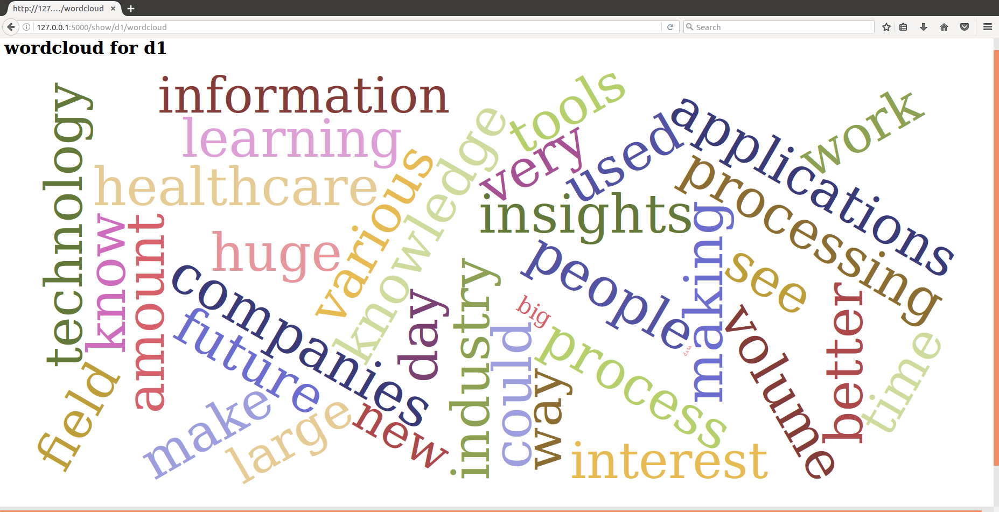
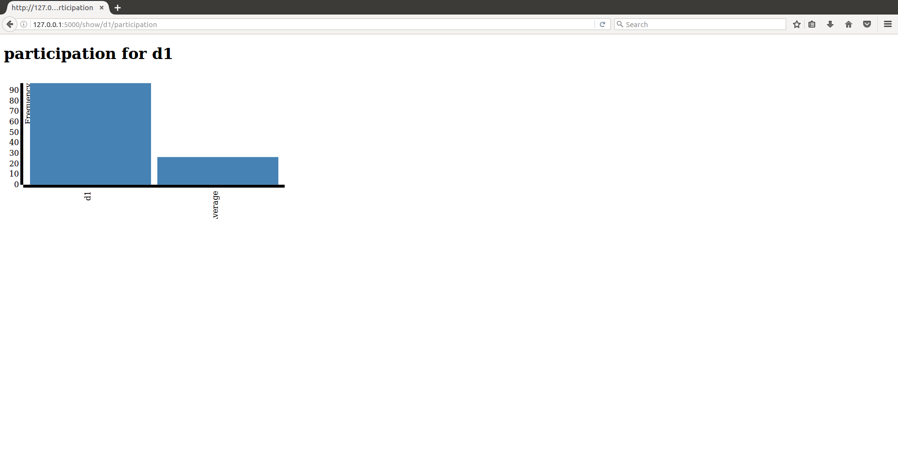

Piazza Data Mining
==================

* Gary Bean (F16-IU-2000) @gbean
* Tim Whitson (F16-IU-2007) @whitstd

Improvements to documentation: Gregor von Laszewski (laszewski@gmail.com)
  
Installation
------------

Limitations:
   The instructions provided here are for Ubuntu and Mac OS X only.

Clone Gitlab Repository
^^^^^^^^^^^^^^^^^^^^^^^

First you have to clone the repository either with::
   
    git clone git@gitlab.com:cloudmesh/piazza.git

or::

    git clone https://gitlab.com/cloudmesh/piazza.git

Install pip if Necessary
^^^^^^^^^^^^^^^^^^^^^^^^^^^^^^^^^^

On Ubuntu do::

    sudo apt-get install python-pip
    
Install Piazza Miner from setup.py
^^^^^^^^^^^^^^^^^^^^^^^^^^^^^^^^^^

From within the project directory call the install::

    cd piazza/project_piazza
    sudo python setup.py install
    
Install MongoDB (if not already installed)
^^^^^^^^^^^^^^^^^^^^^^^^^^^^^^^^^^^^^^^^^^

You can install MongoDB manually or use the corresponding quickstart
which is provided. 

On Ubuntu do::
   
    bash quickstart/ubuntu.sh
    
On Mac OS X do::
    
    cd quickstart
    sudo bash mac.sh
    
Install Piazza Miner
^^^^^^^^^^^^^^^^^^^^
Install Piazza Miner and follow directions to complete `piazza.cfg <piazza_miner/includes/piazza.cfg>`_::

    piazza install

Start MongoDB server
^^^^^^^^^^^^^^^^^^^^
Before Piazza Miner can be run, the MongoDB server must be running. Use bind_ip to ensure MongoDB only allows connections on localhost::
   
    sudo mongod --bind_ip 127.0.0.1 --dbpath ~/piazza/data
    
Use --port flag if you need to specify the port. However, you must also change the port setting in `piazza.cfg <piazza_miner/includes/piazza.cfg>`_ 

Setup Piazza Miner
^^^^^^^^^^^^^^^^^^^^
Setup MongoDB for Piazza Miner. In a new terminal::

    piazza setup

Update Piazza Miner
^^^^^^^^^^^^^^^^^^^

In order to analyze posts and users, the database must be
updated. This could take some time depending on connection speed and
number of posts::

    piazza update

Usage
-----

When entering commands in the command line, note that the --user flag can be given as a search for a user if the uid is unknown. If more than one user is found with the given criteria, you will be given a list of options.

ID::

    piazza history --uid is6mhd3ojax6e5

    User: Timothy Whitson

Search::

    piazza history --user ti

    Multiple users found. Select one:
    0) Name: Aditya Tanikanti, ID: is69ir89d4S
    1) Name: Avadhoot Agasti, ID: is6lom66ah456j
    2) Name: Claude Bernard Augustin, ID: is6prr8ps1v1xi
    3) Name: Neelam Tikone, ID: igwsx64x3qb682
    4) Name: Niteesh Kumar Akurati, ID: is6pcsy0etr1j7
    5) Name: Nitin Sharma, ID: i4u5elhtfg14xr
    6) Name: Shweta Bhartia, ID: is6prnkbzvy1v7
    7) Name: Timothy Whitson, ID: is6mhd3ojax6e5
    8) Name: Vidya Patil, ID: is6n7b7ylJ9

Install Piazza Miner
^^^^^^^^^^^^^^^^^^

::
   
    piazza install

Install files into current directory. Follow instructions on-screen to input login data (NOTE: login data is
optional and will be stored in plaintext in piazza.cfg).

Setup Piazza Miner
^^^^^^^^^^^^^^^^^^

::
   
    piazza setup

Setup MongoDB for Piazza Miner.

Update Piazza Miner
^^^^^^^^^^^^^^^^^^^

::
   
    piazza update
    
Download all posts. This must be done to complete analysis.

Retrieve Folder Information
^^^^^^^^^^^^^^^^^^^^^^^^^^^

Download posts from folder as html::
   
    piazza get <folder> [--comments]

This file will be saved in your config path folder/(folder)/posts.html. --comments includes comments.

Show visual for folder
^^^^^^^^^^^^^^^^^^^^^^

::
   
    piazza show <visual> for <folder>

This file will be saved in /folders/(folder)/(visual).html.

"word cloud":

Image: `wordcloud.png <images/word-cloud-screenshot.png>`_

"participation":

Image: `participation.png <images/participation.png>`_

Get Folders
^^^^^^^^^^^^^^^^

Get list of folders::

    piazza folders
    
Output:

    =====================
    |    folder | posts |
    ============+========
    | logistics |    35 |
    ============+========
    |     polls |     2 |
    ============+========
    ...
   

Get Posts
^^^^^^^^^^^^^^^^

Get posts by CID::
    
    piazza posts <cids> [--comments]
    
Example::
    
    >piazza posts "275, 110"
    
    Subject: Tim Whitson - Where are Big Data jobs now and in the future?
    Author: Timothy Whitson
    Author ID: is6mhd3ojax6e5
    Post CID: 275
    Created: Sep 02, 2016 05:23PM
    Content: ...
    
    Subject: Whitson, Timothy - Why Big Data is interesting to me
    Author: Timothy Whitson
    Author ID: is6mhd3ojax6e5
    Post CID: 110
    Created: Aug 26, 2016 03:35AM
    Content: ...
    ...
    
--comments flag shows post comments.

List Students
^^^^^^^^^^^^^^^^^

List all students alphabetically::

   piazza list students
   
Find User Information
^^^^^^^^^^^^^^^^^^^^^^^^^^

Find users by name::
    
    piazza find <name>
    
Example::    

    >piazza find timothy
    
    ====================================================================================
    |            name | admin | photo |    us |    role | facebook_id |             id |
    ==================+=======+=======+=======+=========+=============+=================
    | Timothy Whitson | False |  None | False | student |        None | is6mhd3ojax6e5 |
    ====================================================================================

   
Search
^^^^^^^^

Search posts, comments, or post subjects. Everything searches in posts, subjects, and comments. Posts, subjects, and comments will be listed in the command line with the query highlighted. Optional --user and --uid flags will filter results only by given author::

    piazza search (post|subject|comment|everything) <query> [(--user=<user>|--uid=<uid>)]
    
Example::

    >piazza search subjects "big data"
    
    Subject: Jing Chen: Big Data Technologies
    Author: Jing Chen
    Author ID: ijbn2h6lVdQ
    Post CID: 1719
    Created: Dec 08, 2016 08:49PM
    Content: There are various new technologies in big data application and analysis including k-mean, hadoop and MapReduce...   
    ...

Class participation for folder
^^^^^^^^^^^^^^^^^^^^^^^^^^^^^^^^

Shows students who have posted in a folder::
   
   piazza class participation for <folder> [--posted=<posted>]
   
--posted option accepts values "yes" or "no", which will filter results for everyone who did or did not post. 

::

    >piazza participation d1

    ========================================================================
    |                             name |            uid | posts | comments |
    ===================================+================+=======+===========
    |                Emmanuel Ngalamou | is7t457w1wg3a5 |     3 |        6 |
    ===================================+================+=======+===========
    |                     Sushmita Ray | is6bgmnu3hl753 |     2 |        9 |
    ===================================+================+=======+===========
    |                         Vibhatha | is6ib4tuhum5y4 |     2 |        6 |
    ===================================+================+=======+===========
    ...

Student completion
^^^^^^^^^^^^^^^^^^^^

Numbers of folders from "mandatory" field in `piazza.cfg <piazza_miner/includes/piazza.cfg>`_ that student has posted in::

    piazza completion (--user=<user>|--uid=<uid>)
    
Example:

In piazza.cfg::

    [folders]
    # mandatory folders for completion, separated by commas
    mandatory = d1, d3, d5, d7, d9, d11, d12, d13, d14
    
Output::

    >piazza completion --user tim
    
    User: Timothy Whitson
    Completion: 100.0%
    "d1" completed on 2016-08-26T03:35:43Z
    "d3" completed on 2016-09-02T17:23:07Z
    "d5" completed on 2016-09-22T17:24:07Z
    "d7" completed on 2016-10-17T03:22:28Z
    "d9" completed on 2016-12-03T17:47:00Z
    "d11" completed on 2016-12-03T18:01:26Z
    "d12" completed on 2016-12-03T18:21:18Z
    "d13" completed on 2016-12-03T18:41:51Z
    "d14" completed on 2016-12-03T18:57:49Z

Student history
^^^^^^^^^^^^^^^^^^

Show user post history::

   piazza history (--user=<user>|--uid=<uid>) [--detailed --comments]

--detailed includes post content. --comments includes comments in history.

Example::

    >piazza history --user tim
    
    User: Timothy Whitson
    User has 15 posts:
    Posted "Tim Whitson - Sensors" in d14 on Dec 03, 2016 06:57PM
    ...
    
--detailed::
    
    >piazza history --user tim --detailed
    
    Subject: Tim Whitson - Sensors
    Author: Timothy Whitson
    Author ID: is6mhd3ojax6e5
    Post CID: 1668
    Created: Dec 12, 2016 04:48PM
    Content: Sensors provide the ability to gather data remotely...
    ...

User interaction
^^^^^^^^^^^^^^^^^^^^^

::

    piazza interaction (--user=<user>|--uid=<uid>)
    
Lists interaction with other users, descending.

::

    >piazza interaction --user gregor
    
    User: Gregor von Laszewski
    =============================================================
    |                             name |            uid | count |
    ===================================+================+========
    |                  Jerome Mitchell | irqfz0l9tur1hv |    64 |
    ===================================+================+========
    |                   Diana Maltsman |    isb62dc7Dd7 |    40 |
    ===================================+================+========
    |                          Lan Lan | is6proyk8es1vy |    34 |
    ===================================+================+========
    ...

Class Activity
^^^^^^^^^^^^^^^^^^^^^^^

::

    piazza activity [--sort=<sort>]
    
Lists users, sorted by who has the most posts + comments. --sort flag allows sorting based on column.

Display activity sorted by likes::

    >piazza activity --sort=likes

    ============================================================================================
    |                             name |            uid | posts | comments | likes | favorites |
    ===================================+================+=======+==========+=======+============
    |                     Mark McCombe |    is6pkgg1YYG |    14 |       79 |     7 |         3 |
    ===================================+================+=======+==========+=======+============
    |             Gregor von Laszewski | is28edmcmde4ht |   187 |      687 |     6 |        84 |
    ===================================+================+=======+==========+=======+============
    |                      (anonymous) |           None |    28 |        0 |     4 |         3 |
    ===================================+================+=======+==========+=======+============
    ...

Flask Server
^^^^^^^^^^^^^^

::

    piazza flask
    
Runs on http://127.0.0.1:5000/ by default. Flask routes are based on DOCOPT. Navigating to the index will display available routes.

Configuration
===============

The configuration is done with the help of the 
`piazza.cfg <piazza_miner/includes/piazza.cfg>`_ file. 

To set the login information modify the login section::
   
    [login]
    
    # your Piazza email
    email =
    
    # your Piazza password
    password = 

To set class ID for class to be analyzed and frequency for update
reminders, set the network section::
   
    [network]
    
    # network/class ID
    id =
    
    # auto update frequency
    # options: hour, day, week, always, never
    update = day
    
MongoDB server information for port/user configuration::

    [mongo]

    # mongodb username
    username = 

    # mongodb password
    password = 

    # mongodb port (default 27017)
    port =

To set mandatory folders, which will be compared with folders that
students have completed, set the folders section::
   
    [folders]
    
    # mandatory folders for completion, separated by commas
    mandatory =
